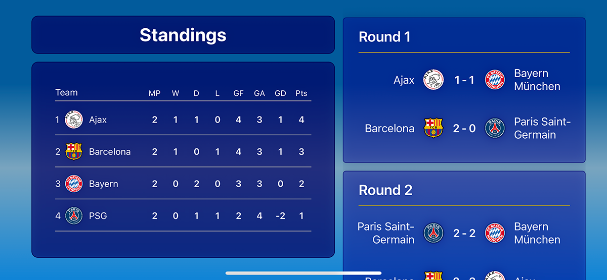
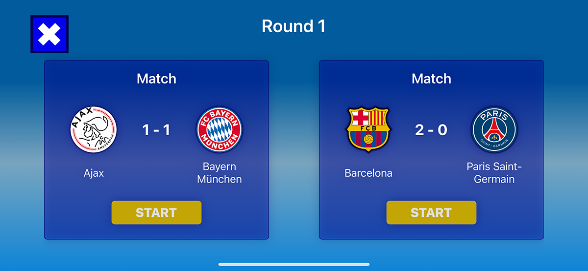
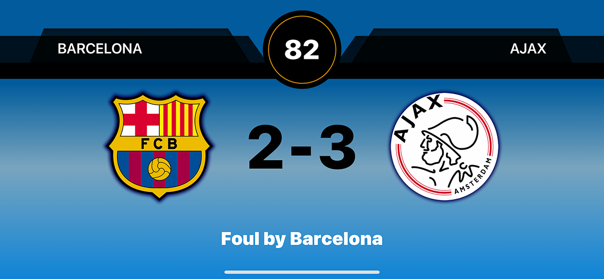
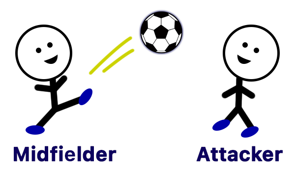
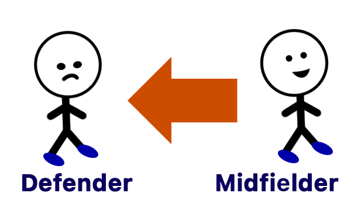
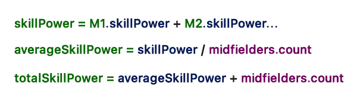
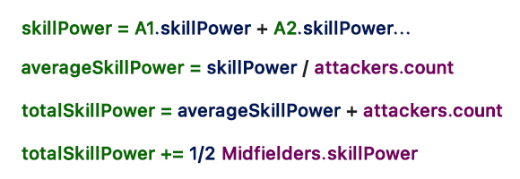
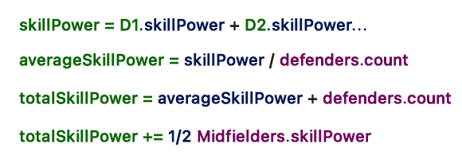

# (Swift 5, iOS 16): MVVM, Combine, UIKit and XCTest.

This project is a football/soccer tournament simulation with 4 teams. Two teams must play against each other on every Match in the tournament. The outcome from each Match is determined by the players skillPower, among other factors.

The teams standings on the leaderboard are then calculated based on the outcomes from these matches/games.

 

## Table of contents
* [Home Screen ViewController](#homeScreen)
* [Round Games ViewController](#roundGames)
* [Game Simulation ViewController](#gameView)
* [How the Game Simulation Works](#gameSimulation)

 

 

## Home Screen ViewController

The Home Screen viewController is the root viewController, and is in charge of displaying all the team standings on the leaderboard and show the rounds these teams must play.

 

 

### Team Standings:

The Team models contain within a Standings model, which gets updated every time a new match is played.

To calculate the Team's position in the leaderboard, we sort the Teams by their standings.

The sorting process:

* Compare between 2 teams at a time.

* The Team with the most Points wins.

* If both teams share the same Points count, then compare them by the most positive Goal Difference.

* If both teams share the same Goal Difference count, then compare them by the Goals For count.

 

### Rounds CollectionView

On first app launch, the Rounds for the tournament don't exist. Therefore, they are created for the first time with the teams provided, and then they are saved to the DocumentDirectory for future retrieval.

The Round creation process:

* Utilized the round-robin method used in many official football tournaments, including the FIFA World Cup.

* In a round-robin tournament, every team play each other once.

* Number of rounds = n-1 where n is the number of teams

* Number of games = (n/2)(n-1)

Each Round model contains a Match model.

Every Round can contain any given of matches.

A single Match object contains information such as, the two teams for that match, and the scores (outcome) if the game has been played already.

 

 

## Round Games ViewController

This viewController shows only the matches/games for a user-selected Round.

 

 

 

## Game Simulation ViewController

Displays a simulation of a match between two teams, and it updates its UI based on the Game Simulation's state of the game.

 

Each Match has five game states:

* `.aboutToStart`: - Right before the game starts.

* `.goalScored`: - When one of the two teams scores a goal.

* `.inProgress`: - The game is ongoing, since the game has not reach 90 Plays.

* `.halfTime`: - The game has reached 45 Plays, and it is time for the teams to switch sides.

* `.finished`: - The game has ended and it is time to update the Round.Match and Team models. And then, it must recalculate the teams standings to update the Standings board located in the HomeScreen.

 

 

##  How the Game Simulation Works

* Two teams must engage in a head-to-head battle for the ball, with the ultimate goal of scoring.

* Each 1 Play in the game, represents 1 minute in real life.

  - (e.g.) A game ends when 90 Plays have been reached, which represents the 90 minutes of play in a real soccer match.

* The homeTeam kicks-off the first half of the game, and the visitorTeam kicks-off the second half of the game, right after half-time.

 

### The players must have a head2head battle based on their positions on the field

* Keeper vs. Attacker
* Defender vs. Attacker
* Midfielder vs. Midfielder

1. Determine which Team wins the head2head based on their skillPower.

   - (e.g.) `If team2.skillPower > team1.skillPower {}`

2. When a Team wins, determine if the Team won the ball by committing a foul.

   - If the team did not commit a foul, then it gets to keep the ball and passes it forward in the field.
   
    

   - If the Team committed a foul, then it loses the ball to the other team, and must fall back to a defense position trying to win back the ball.
   
    

3. Scoring a goal.

   - Scoring a goal happens when an attacker from team1, wins the head2head battle against the goal keeper from team2.

 

### Calculating the SkillPower:

Every individual player in the line-up has a skillPower value.

1. Calculate the skillPower for a Position in the line-up (e.g., the defenders). Keep in mind that the Attackers and the Defenders get help from the Midfielders during the head2head battles. The calculations are as follows:

   * Keeper: His skillPower value is multiplied by scoringDifficulty. The scoringDifficulty variable, makes the goal keeper more powerful against the opponent's attackers.

   

   * Midfielders: Add up all the midfielders skillPowers, and get the average. Then add +1 for every midfielder in the line-up.

   

   * Attackers: Add up all the attackers skillPowers, and get the average. Then add +1 for every attackers in the line-up. Then add + 1/2 midfielders.skillPower.

   

   * Defenders: Add up all the defenders skillPowers, and get the average. Then add +1 for every defenders in the line-up. Then add + 1/2 midfielders.skillPower.

   

2. Obtain the final skillPower by subtracting the AthleticDecay to that skillPower.

3. Finally, get a random number in the range of (0...skillPower).

   * This random number is the skillPower with which the Team will battle against the opposing team.

 

### Calculating AthleticDecay:

* The AthleticDecayCoefficient has a starting value of 0.025.

   - When players receive a foul, then this starting value (AthleticDecayCoefficient) increases based on the type of foul they received.

   - A foul that generated a red card will injure the players more than a simple foul that awards them a free-kick.

* Calculate the AthleticDecay per play.

   - Every time a position in the team goes into a head2head battle, we added +1 play to this team's position.

   - These plays are then used to calculate the final AthleticDecay, since the more players battle, the less fit they become over the course of the game.

#### Get The AthleticDecay per play:

1. Multiply 0.0001 by the skillPower for the current Position in the field. The greater the skillPower, the greater this number will be.

2. Subtract the result from STEP 1, from the AthleticDecayCoefficient. 

   - The more fit the players are at the start of the game, the least AthleticDecay they will have.

#### Get the total AthleticDecay so far in the game:

3. Multiply the result from STEP 2, by the number of plays the players have played.

